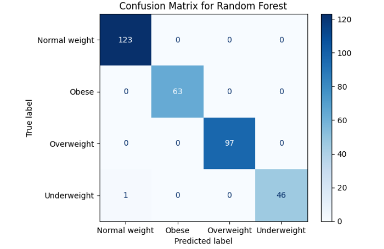
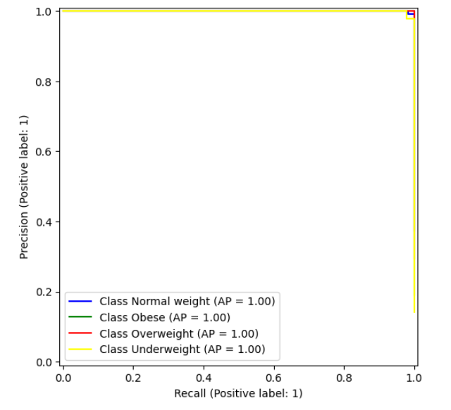

# Classification of obesity Category Level

**Author** Aso Ali

## Executive summary

#### Project overview and goals
The objective of this exercise is the ability to predict person's body type and its obesity level based on certain criteria like Age, Gender, Height, weight, BMI and physical activity level. The prediction will classify the person to one of these categories; Normal Weight, Obese, Overweight, Underweight.

#### Rationale
Obesity severely strains the healthcare system, driving nearly $173 billion in direct annual medical costs in the U.S. alone. It dramatically increases the risk for chronic diseases—such as type 2 diabetes, heart disease, and some cancers—while challenging daily operations with higher surgical complication rates and specialized equipment needs.
Obesity significantly increases healthcare costs, driving up U.S. direct medical expenses by nearly $173 billion annually (according to the Centers for Disease Control and Prevention). Adults with obesity incur medical expenditures that are roughly double or 36% to 100% higher than those of normal-weight individuals, with costs escalating alongside the severity of the condition and related chronic illnesses.

#### Research Question
To classify a new sample of the population to Obesity level, and to understand is the population obesity level is increasing or decreasing overtime. This will help to predict weather the population health risks increased or decreased overtime and also gives an idea of how the health trend will be in the future.

## Model Outcomes or Predictions
The problem is a classification problem and all the models used are supervised machine learning models. For this project i will be using five different models 
* RandomForestClassifier
* LogisticRegression
* KNeighborsClassifier
* DecisionTreeClassifier
* SVC (Support Vector Classifier)

The output of these models will include the Accuracy, Precision, Recall and f1 scores in the form of a table

## Data Set Information:
I have obtained the date from [Kraggle](https://www.kaggle.com/datasets/mrsimple07/obesity-prediction). 

The data is collection of features that affect a person's classification to be one of the obesity related classes Normal weight, Obese, Overweight, and Underweight. 
The Features are 

## Data Preprocessing/Preparation
#### 1. Analyze the Data
* **Missing Data's** : looking at the data for null and missing datas, the data did not have any missing one

  
  
* **Analyze Target Balance** : Looking at the target classes, while the classes where not totally balanced it was also not too bad

  
  
* **Feature selection** : I have followed two ways to do selection depending if it is for the base modeling analysis or for the final prediction models
  *  For the base model feature selection i have selected all the features regardless of its importance
  *  For the final data prediction, i have only selected the features that are the most correlate and affects the obesity and they are BMI, Weight, and Height. The selection of height in this case because its strong correlation to weight where the taller the person is the more weight he has regardless of being overweight

#### 2. Data Split
the data split is 30/70 with stratiy paremeter set to target to prevent training bias

X_train, X_test, y_train, y_test = train_test_split(X, y, random_state = 42, test_size=0.33, stratify=y)

#### 3. Encoding the date
The data had only one string feature 'Gender' which i encoded using OrdinalEncoder 

    encoder = ce.OrdinalEncoder(cols=['Gender'])
    X_train = encoder.fit_transform(X_train)
    X_test = encoder.fit_transform(X_test)

## Modeling
Two data modeling and 5 modeling algorithms used in this excercise

The Modeling algorithms are 
* RandomForestClassifier
* LogisticRegression
* KNeighborsClassifier
* DecisionTreeClassifier
* SVC (Support Vector Classifier)
  
1. **Base Model** :
   For the Base mode, the data was used with all its features and without any feature engineering’s, and the Model algorithms were run with their default values. The aim if this excersize to get a base performance data for the predictions
2. **Final Modeling**:
   For the data i have selected 3 features, two of the features 'BMI' and 'Weight' are primary features that obesity level can be identified from, the other feature is 'Height' which i selected since height does affect the weight and therefore it dose influence the overall obesity level. To find the strongest features that affect Obesity Level Category, I plotted bar plot between each of the features and the target to visualize the correlation strength between them. As an example:

   
   

   To tune the hyperparameters for all models i used **GridSearchCV** (Grid Search Cross-Validation), my selection decision to use GridSearchCV was based on the fact that my data is not large and computational cost penelty is not high. I have also used **OneVsRestClassifier** (One-vs-All or OvR) for training in the case of models that do not handle multi-class datas well.

## Model Evaluation
As I mentioned in the previous section, I have used two data modeling and five modeling algorithms. First getting the prediction scores using base model using default parameters, them getting the performance scores using tuned hyperparameters for the models.

1. **Base Model Evaluation**
   Using the data with all features and without any feature engineering, the data i haot it was a very high score. Having the calsses not totally balaced, i did use Precision and recall scores as a guide and not the accuracy. From the data i got, the scores were already high and i do think its because the strong correlation between 'BMI' and 'Weight' Features to the target "ObesityCategory'

    

   The for further analysis i used the Confusion matrix to validate TP and TN. it was clead from the matrix that models did give a high precision in prediciting future datas.

    

   As an example, calculating the precision and recall for 'Obese" feature from above matrix

   TP = 62
   
   FP = 0 
   
   FN = 1

   pression = 62/62
   
   recall = 62/63

   This result is a perfect score.

2. **Final Modeling"
   For the final modelings i used only used three features "BMI', 'Weight' and 'Height'. I have also ran V yo tune all the hyper-parameters. THe scoring improved a little but not much, the base model scores was already high and it is expected to be a little improvements.

   

   Again for further analysis, i have obtained the Confusion matrix. As per the Base model, i have relied on the precision and recall for scoring. 

   

    TP = 63
   
   FP = 0 
   
   FN = 0

   pression = 63/63
   
   recall = 63/63

   Again this result is a perfect score.

   To have another visual verification, i drew the precision recall curve, well no surprice it was perfect too
   
   

## My Final thoughts
   To be honest, for this data it seem that all model did a great job of giving high scores, yes RandomForestClassifies and Decission Tree gave the highest but i think the other models did welll too. So i have got such high scores? well i am going to list them bellow and all these i am listing will have a great effect on predicting real workd data's.

   * The first thong it bothered me with this data is that it was too clean, no miising datas and no abnormaility. THis data has already been cleaned for me but the problem is that i do not have an insite of how that cleaning is done. How the missing datas been dealt with? removing them, subsitutin them with their average and how is the average been taken. it is a black box at this point. 
   * The other thing is the data sample is not large enough to get confident that it i have actually trained these models on enough data to be able to predict future data's correctly.
   * Lack of features, this data has only six features. While it may be good enough to predict the Obesity Category Level, it lacks features to give me more information such as
     * Adding a date and time line will gives more information weather the population weight is increasing or decreasin with time, that would help to predict the health cost in the future
     * Adding geographical location will help directing health cost more to the areas needed
     * Adding Occupation to the features helps to identify wich work cases overwight and helps to direct helth recomendation to workers in these fields
     * Adding diet helthiness, for example having a feature to mark the over all diet of the person as (Healthy, not Healthy) and define what these categories meant, helps to direct health cost to populatin with unhealthy diet (fried foods for example or consuming alot of processed foods) 

   
   
   

## Outline of project

- [kaggle](https://www.kaggle.com/datasets/mrsimple07/obesity-prediction)
- [Capstone jupyter notebook](https://github.com/asoali67/Capstone/blob/main/Capstone.ipynb)

##### Contact and Further Information
