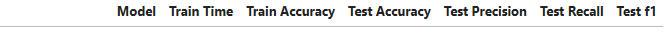
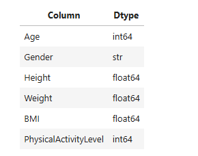
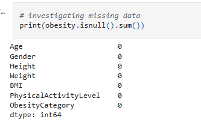
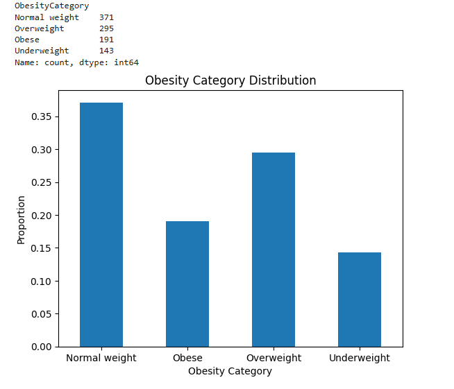
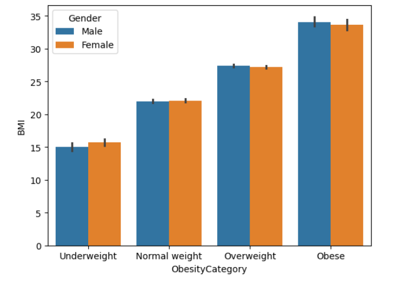
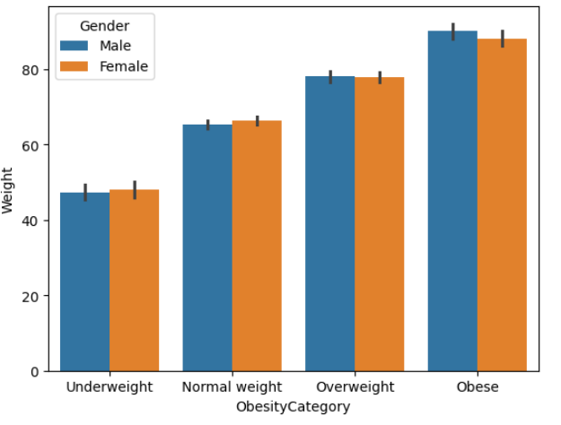
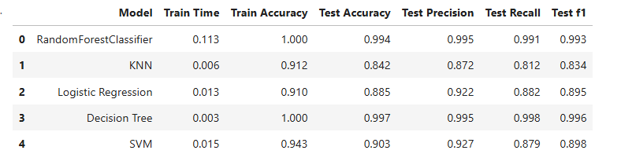
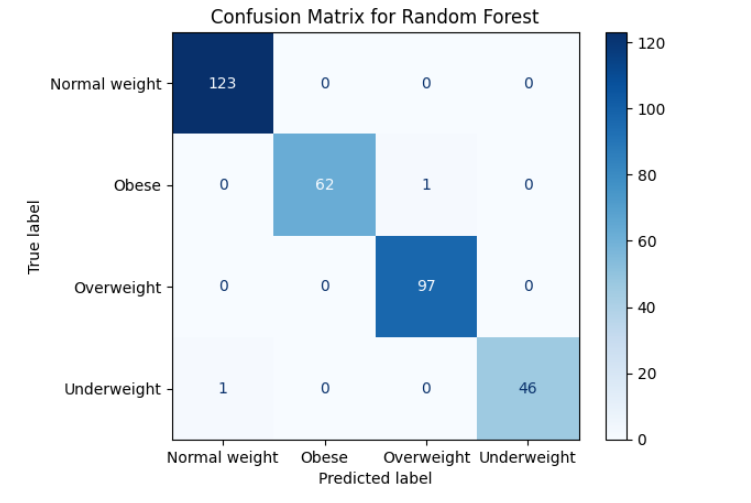
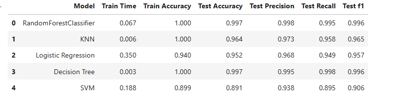

# Classification of person's obesity 

**Author** Aso Ali

## Executive summary

#### Project overview and goals
The objective of this exercise is the ability to predict person's body type and its obesity level based on certain criteria like Age, Gender, Height, weight, BMI and physical activity level. The prediction will classify the person to one of these categories; Normal Weight, Obese, Overweight, Underweight.

#### Rationale
Obesity severely strains the healthcare system, driving nearly $173 billion in direct annual medical costs in the U.S. alone. It dramatically increases the risk for chronic diseases—such as type 2 diabetes, heart disease, and some cancers—while challenging daily operations with higher surgical complication rates and specialized equipment needs.
Obesity significantly increases healthcare costs, driving up U.S. direct medical expenses by nearly $173 billion annually (according to the Centers for Disease Control and Prevention). Adults with obesity incur medical expenditures that are roughly double or 36% to 100% higher than those of normal-weight individuals, with costs escalating alongside the severity of the condition and related chronic illnesses.

#### Research Question
To classify a new sample of the population to Obesity level, and to understand is the population obesity level is increasing or decreasing overtime. This will help to predict weather the population health risks increased or decreased overtime and also gives an idea of how the health trend will be in the future.

## Model Outcomes or Predictions
The problem is a classification problem and all the models used are supervised machine learning models. For this project i will be using five different models 
* RandomForestClassifier
* LogisticRegression
* KNeighborsClassifier
* DecisionTreeClassifier
* SVC (Support Vector Classifier)

The out put of these model will include the Accuracy, Precision, Recall adn f1 scores in the form of a table

## Data Set Information:
I have obtained the date from [Kraggle](https://www.kaggle.com/datasets/mrsimple07/obesity-prediction). 

The data is collection of features that affect a persons classification to be one of the obesity related classes Normal weight, Obese, Overweight, and Underweight. 
The Features are 

## Data Preprocessing/Preparation
#### 1. Analyze the Data
* **Missing Data's** : looking at the data for null and missing datas, the data did not have any missing one

  
  
* **Analyze Target Balance** : Looking at the target classes, while the classes where not totally balanced it was also not too bad

  
  
* **Feature selection** : I have followed two wayes to do selection depending if it is for the base modeling analysis or for the final prediction mode;s
  *  For the base model feature selection i have selected all the features regarless of its importance
  *  For the final data prediction, i have only selected the features that are the most correlate and affects the obesity and they are BMI, Weight, and Height. The selction of hight in this case because its strong correlation to weight where the taller the person is the more weight he has regardless of bsing overweight

#### 2. Data Split
the data split is 30/70 whith stratiy set to prevent training bias

X_train, X_test, y_train, y_test = train_test_split(X, y, random_state = 42, test_size=0.33, stratify=y)

#### 3. Encoding the date
The data had only one string feature 'Gender' which i encoded using OrdinalEncoder 

    encoder = ce.OrdinalEncoder(cols=['Gender'])
    X_train = encoder.fit_transform(X_train)
    X_test = encoder.fit_transform(X_test)

## Modeling
Two data modeling and 5 modeling algorithms used in this excersize

The Modeling algorithms are 
* RandomForestClassifier
* LogisticRegression
* KNeighborsClassifier
* DecisionTreeClassifier
* SVC (Support Vector Classifier)
  
1. **Base Model** :
   For the Base mode, the data was used with all its features and without any feature enginerings, and the Model algorithems were ran with there default values. The aim if this excersize to get a base performance data for the predictions
2. **Final Modeling**:
   For the data i have selected 3 features, two of the features 'BMI' and 'Weight' are primary features that obesity level can be identified from, the other feature is 'Height' which i selected since hight does affect the weight and therefore it dose influence the overall obesity level. To fined the strongest features that affect Obesity Level Category, I ploted bar plot between each of the fratures and the target to visualize the correlation strength between them. As an example:

   
   

   To tune the hyperparameters for all models i used **GridSearchCV** (Grid Search Cross-Validation), my selection decition to use GridSearchCV was based on the fact that my data is not large and comutational cost penelty is not high. I have also used **OneVsRestClassifier** (One-vs-All or OvR) for training in the case of models that do not handle mulyi-class datas well.

## Model Evaluation
As I menssioned in the previous section, I have used two data modeling and five modeling algorithems. First getting the prediction scores using base model using default parametes, them getting the performance scores using tuned hyperparameters for the models.

1. **Base Model Evaluation**
   Using the data with all features and without any feature engineering, the data i haot it was a very high score. Having the calsses not totally balaced, i did use Precision and recall scores as a guide and not the accuracy. From the data i got, the scores were already high and i do think its because the strong correlation between 'BMI' and 'Weight' Features to the target "ObesityCategory'

    

   The for further analysis i used the confution matrix to validate TP and TN. it was clead from the matrix that models did give a high precision in prediciting future datas.

    

   As an example, calculating the precision and recall for Normal weight feature from above matrix

   TP = 123
   
   FP = 0 + 0 + 1 = 1
   
   FN = 0

   pression = 123/(123 +1)
   
   recall = 123/123

   This result is a very high score.

2. **Final Modeling"
   For the final modelings i used only used three features "BMI', 'Weight' and 'Height'. I have also ran V yo tune all the hyper-parameters. THe scoring improved a little but not much, the base model scores was already high and it is expected to be a little improvements.

   
   

   
   
   

## Outline of project

- [kaggle](https://www.kaggle.com/datasets/mrsimple07/obesity-prediction)
- [Capstone jupyter notebook](https://github.com/asoali67/Capstone/blob/main/Capstone.ipynb)

##### Contact and Further Information
